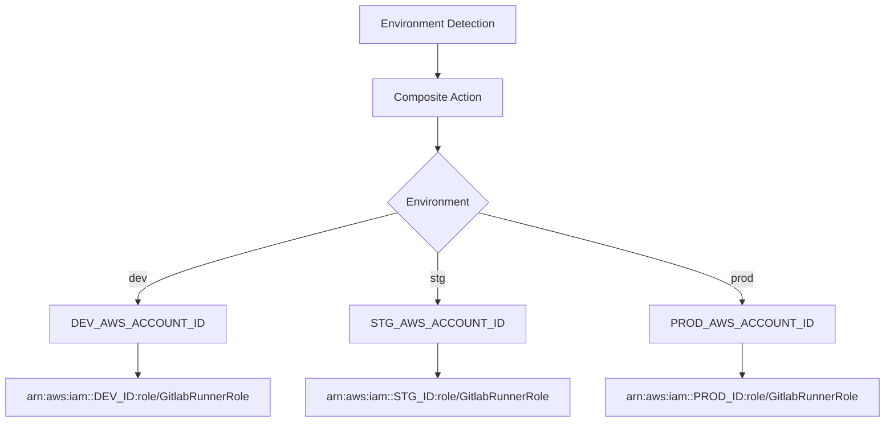

# AWS Credentials Setup for GitHub Actions

## Overview

The deployment workflow uses environment-specific AWS account IDs with a consistent IAM role name across all environments for secure, scalable credential management.

## Architecture

### Role ARN Pattern

```text
arn:aws:iam::{ACCOUNT_ID}:role/GitlabRunnerRole
```

### Required GitHub Secrets

The repository needs these three secrets configured in GitHub:

| Secret Name | Description | Example Value |
|-------------|-------------|---------------|
| `DEV_AWS_ACCOUNT_ID` | AWS Account ID for development environment | `123456789012` |
| `STG_AWS_ACCOUNT_ID` | AWS Account ID for staging environment | `234567890123` |
| `PROD_AWS_ACCOUNT_ID` | AWS Account ID for production environment | `345678901234` |

## Workflow Integration

### How It Works

1. **Environment Detection**: Workflow determines environment from branch or manual input
2. **Dynamic Role Construction**: Composite action builds role ARN using environment-specific account ID
3. **Single Role Name**: Same role name (`GitlabRunnerRole`) across all environments
4. **Clean Integration**: All jobs use `${{ needs.prepare-deployment.outputs.deploy_role_arn }}`

### Implementation Details

#### Composite Action (`setup-deploy-config`)

The `setup-deploy-config` composite action handles all credential logic:

```yaml
# Environment variables passed to composite action
env:
  DEV_AWS_ACCOUNT_ID: ${{ secrets.DEV_AWS_ACCOUNT_ID }}
  STG_AWS_ACCOUNT_ID: ${{ secrets.STG_AWS_ACCOUNT_ID }}
  PROD_AWS_ACCOUNT_ID: ${{ secrets.PROD_AWS_ACCOUNT_ID }}
```

**Key Features:**

- **Environment Variable Validation**: Fails fast if required account ID is missing
- **Dynamic Role ARN Construction**: Uses bash variable expansion to build role ARNs
- **Centralized Configuration**: All deployment settings in one place

#### Workflow Structure

```yaml
jobs:
  prepare-deployment:
    outputs:
      deploy_role_arn: ${{ steps.config.outputs.deploy_role_arn }}
    steps:
      - uses: ./.github/actions/setup-deploy-config
        env:
          DEV_AWS_ACCOUNT_ID: ${{ secrets.DEV_AWS_ACCOUNT_ID }}
          STG_AWS_ACCOUNT_ID: ${{ secrets.STG_AWS_ACCOUNT_ID }}
          PROD_AWS_ACCOUNT_ID: ${{ secrets.PROD_AWS_ACCOUNT_ID }}
  
  deploy-cfn-templates:
    needs: prepare-deployment
    steps:
      - uses: aws-actions/configure-aws-credentials@v4
        with:
          role-to-assume: ${{ needs.prepare-deployment.outputs.deploy_role_arn }}
```

**Benefits:**

- Clean, readable workflow code
- No complex GitHub Actions expressions
- Consistent role ARN across all jobs
- Easy to debug and maintain

### Configuration Flow



### Benefits

#### ✅ **Scalability**
- Easy to add new environments (just add `{ENV}_AWS_ACCOUNT_ID` secret)
- Consistent role naming across environments
- No hardcoded values in workflow files

#### ✅ **Security**
- Environment-specific AWS accounts for isolation
- OIDC-based authentication (no long-lived credentials)
- Principle of least privilege per environment

#### ✅ **Maintainability**
- Single point of configuration in composite action
- No repetitive role ARN construction
- Clear separation of concerns

#### ✅ **Flexibility**
- Same role name works across different AWS accounts
- Easy to update account IDs without touching workflow code
- Supports any number of environments

## AWS Setup Requirements

### Per Environment

In each AWS account (dev/stg/prod), create:

#### 1. IAM Role: `GitlabRunnerRole`
```json
{
  "Version": "2012-10-17",
  "Statement": [
    {
      "Effect": "Allow",
      "Principal": {
        "Federated": "arn:aws:iam::{ACCOUNT_ID}:oidc-provider/token.actions.githubusercontent.com"
      },
      "Action": "sts:AssumeRoleWithWebIdentity",
      "Condition": {
        "StringEquals": {
          "token.actions.githubusercontent.com:aud": "sts.amazonaws.com"
        },
        "StringLike": {
          "token.actions.githubusercontent.com:sub": "repo:{ORG}/{REPO}:*"
        }
      }
    }
  ]
}
```

#### 2. Required IAM Permissions
Attach policy with minimum required permissions:
- `s3:ListBucket` on all deployment buckets
- `s3:GetObject`, `s3:PutObject`, `s3:DeleteObject` on deployment bucket contents
- Any additional permissions needed for your specific deployment process

### OIDC Provider Setup

Each AWS account needs the GitHub OIDC provider configured:
- **Provider URL**: `https://token.actions.githubusercontent.com`
- **Audience**: `sts.amazonaws.com`
- **Thumbprint**: `6938fd4d98bab03faadb97b34396831e3780aea1`

## Migration from Single Secret

### Old Approach (Deprecated)
```yaml
role-to-assume: ${{ secrets.AWS_DEPLOY_ROLE_ARN }}
```

### New Approach (Current)
```yaml
role-to-assume: ${{ needs.prepare-deployment.outputs.deploy_role_arn }}
```

### Migration Steps

1. **Create Environment-Specific Secrets**:
   - Add `DEV_AWS_ACCOUNT_ID`, `STG_AWS_ACCOUNT_ID`, `PROD_AWS_ACCOUNT_ID` to repository secrets
   
2. **Update AWS IAM Roles**:
   - Ensure each environment has `GitlabRunnerRole` 
   - Verify OIDC provider configuration
   
3. **Remove Old Secret**:
   - Delete `AWS_DEPLOY_ROLE_ARN` secret after migration is complete

4. **Test Deployment**:
   - Run workflow_dispatch with each environment to verify

## Troubleshooting

### Common Issues

#### Missing Environment Variable
```text
Error: DEV_AWS_ACCOUNT_ID environment variable is not set
```
**Solution**: Add the required secret to GitHub repository secrets

#### Role Not Found
```text
Error: Could not assume role with OIDC: Role does not exist
```
**Solution**: Verify role name `GitlabRunnerRole` exists in target account

#### Invalid Account ID
```text
Error: Invalid account ID format
```
**Solution**: Check GitHub secret value contains only 12-digit account ID

#### OIDC Trust Relationship
```text
Error: Not authorized to perform sts:AssumeRoleWithWebIdentity
```
**Solution**: Verify OIDC provider and trust relationship configuration

#### Workflow Syntax Errors
```text
Context access might be invalid: PROD_AWS_ACCOUNT_ID
```
**Solution**: Ensure environment variables are properly passed to composite action

### Validation Commands

```bash
# Check role exists
aws iam get-role --role-name GitlabRunnerRole

# List OIDC providers
aws iam list-open-id-connect-providers

# Test assume role (replace with actual account ID)
aws sts assume-role-with-web-identity \
  --role-arn arn:aws:iam::123456789012:role/GitlabRunnerRole \
  --role-session-name test-session \
  --web-identity-token $GITHUB_TOKEN
```

## Security Best Practices

### ✅ **Recommended**
- Use separate AWS accounts for each environment
- Implement least-privilege IAM policies
- Regularly audit role permissions and usage
- Monitor CloudTrail for deployment activities

### ❌ **Avoid**
- Using the same AWS account for multiple environments
- Overly broad IAM permissions
- Long-lived access keys or credentials
- Hardcoding account IDs in workflow files

## Support

For issues with this credential setup:

1. **Check GitHub Secrets**: Verify all three account ID secrets are configured
2. **Validate AWS Setup**: Ensure roles and OIDC providers exist in each account
3. **Test Workflow**: Use workflow_dispatch to test each environment individually
4. **Review CloudTrail**: Check AWS logs for authentication and permission issues
