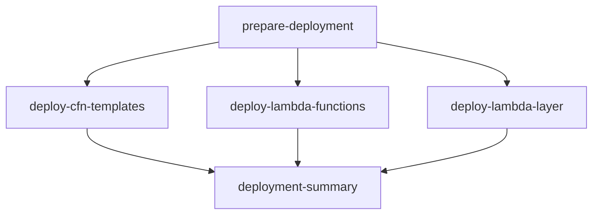

# GitHub Actions Workflow Verification Guide

## Overview

This guide provides comprehensive verification steps to ensure all GitHub Actions workflow components are properly configured and working together coherently.

## Pre-Deployment Checklist

### 1. Repository Secrets Verification

Ensure all required secrets are configured in GitHub repository settings:

```bash
# Required secrets (values shown are examples):
DEV_AWS_ACCOUNT_ID  = "123456789012"
STG_AWS_ACCOUNT_ID  = "234567890123" 
PROD_AWS_ACCOUNT_ID = "345678901234"
```

**Verification Steps:**
1. Go to repository Settings → Secrets and Variables → Actions
2. Confirm all three `*_AWS_ACCOUNT_ID` secrets exist
3. Verify account IDs are 12-digit numbers without spaces or dashes

### 2. Composite Actions Integrity Check

Verify all composite actions have correct structure:

#### setup-deploy-config
- ✅ **Input**: `environment` parameter
- ✅ **Outputs**: All 6 required outputs (`s3_bucket_cfn`, `bucket_pattern_regional`, `aws_region`, `python_version`, `timestamp`, `deploy_role_arn`)
- ✅ **Environment Variables**: Properly expands `${DEV_AWS_ACCOUNT_ID}`, `${STG_AWS_ACCOUNT_ID}`, `${PROD_AWS_ACCOUNT_ID}`
- ✅ **Validation**: Fails fast if required environment variable is missing

#### deploy-cfn
- ✅ **Functionality**: Uses enhanced s3_sync.py with dual deployment
- ✅ **File Patterns**: Supports both YAML and JSON CloudFormation templates
- ✅ **Integration**: Uses uv for Python dependency management

#### deploy-lambdas
- ✅ **Multi-Region**: Uses bucket pattern for regional deployment
- ✅ **Matrix Strategy**: Supports parallel deployment of Services and Cleaners
- ✅ **ZIP Creation**: Creates ZIPs from nested directories

#### deploy-layer
- ✅ **Layer Building**: Properly builds Python dependencies and custom modules
- ✅ **Multi-Region**: Deploys to all regional buckets
- ✅ **Cleanup**: Removes build artifacts after deployment

### 3. Workflow Structure Validation

#### Job Dependencies


#### Environment Variable Flow
```yaml
# Workflow → Composite Action
prepare-deployment:
  env:
    DEV_AWS_ACCOUNT_ID: ${{ secrets.DEV_AWS_ACCOUNT_ID }}
  # → Composite Action expands to role ARN
  outputs:
    deploy_role_arn: arn:aws:iam::123456789012:role/GitHubActionsRunnerRole

# All subsequent jobs use:
role-to-assume: ${{ needs.prepare-deployment.outputs.deploy_role_arn }}
```

## Testing Procedures

### 1. Syntax Validation

Run local validation checks:

```bash
# Check workflow syntax
gh workflow view deploy-to-s3.yml

# Validate composite actions
for action in .github/actions/*/action.yml; do
  echo "Validating $action"
  yq eval '.' "$action" > /dev/null || echo "❌ Syntax error in $action"
done

# Test s3_sync.py enhancements
cd .github/scripts
python3 -m py_compile s3_sync.py
echo "✅ s3_sync.py syntax OK"
```

### 2. Environment-Specific Testing

#### Development Environment Test
```yaml
# Manual workflow dispatch
Environment: dev
Deploy CFN: true
Deploy Lambdas: true
```

**Expected Behavior:**
- Uses DEV_AWS_ACCOUNT_ID secret
- Deploys to dev-cyngular-onboarding bucket (CFN)
- Discovers regional buckets: dev-cyngular-onboarding-{region}
- Creates both timestamp and latest paths

#### Staging Environment Test
```yaml
Environment: stg
Deploy CFN: false
Deploy Lambdas: true
```

**Expected Behavior:**
- Uses STG_AWS_ACCOUNT_ID secret
- Skips CFN deployment
- Deploys only Lambda functions and layer

#### Production Environment Test
```yaml
Environment: prod
Deploy CFN: true
Deploy Lambdas: true
```

**Expected Behavior:**
- Uses PROD_AWS_ACCOUNT_ID secret
- Deploys to production buckets (no prefix)
- Full deployment with comprehensive logging

### 3. Error Handling Verification

#### Missing Secret Test
1. Temporarily remove `DEV_AWS_ACCOUNT_ID` secret
2. Run workflow with dev environment
3. **Expected**: Workflow fails fast with clear error message

#### Invalid Environment Test
1. Modify composite action to test unknown environment
2. **Expected**: Clear error message "Unknown environment: test"

#### AWS Role Missing Test
1. Use non-existent AWS account ID
2. **Expected**: OIDC role assumption fails with descriptive error

## Integration Testing

### 1. End-to-End Deployment Flow

**Test Scenario:** Complete deployment from dev → stg → prod

```bash
# 1. Create feature branch
git checkout -b test/workflow-verification
git push origin test/workflow-verification

# 2. Trigger dev deployment (automatic on push)
# Verify: Uses dev environment, deploys to dev buckets

# 3. Merge to stg branch  
git checkout stg
git merge test/workflow-verification
git push origin stg

# 4. Trigger prod deployment via main branch
git checkout main
git merge stg
git push origin main
```

### 2. Multi-Region Verification

**Verify Regional Bucket Discovery:**
1. Create test buckets in AWS: `dev-cyngular-onboarding-us-east-1`, `dev-cyngular-onboarding-eu-west-1`
2. Run dev deployment
3. **Expected**: s3_sync.py discovers both buckets and deploys to each region

### 3. Dual Deployment Verification

**Check Both Deployment Paths:**
```bash
# After successful deployment, verify S3 structure:
aws s3 ls s3://dev-cyngular-onboarding/stacks/
# Expected: {timestamp}/ and latest/ directories

aws s3 ls s3://dev-cyngular-onboarding-us-east-1/lambdas/services/
# Expected: {timestamp}/ and latest/ directories
```

## Monitoring and Validation

### 1. GitHub Actions Logs Review

**Key Log Sections to Verify:**

#### Deployment Configuration
```text
🚀 Deployment Configuration:
  Environment: dev
  CFN S3 Bucket: dev-cyngular-onboarding
  Regional Bucket Pattern: dev-cyngular-onboarding
  AWS Region: us-east-1
  Python Version: 3.11
  Timestamp: 20240101-120000
```

#### S3 Sync Output
```text
🔍 Validating bucket access: dev-cyngular-onboarding
  ✓ Bucket dev-cyngular-onboarding exists and is writable

📦 Syncing files from ./CFN to s3://dev-cyngular-onboarding/stacks/20240101-120000
  ✓ Uploaded: Core.yaml → stacks/20240101-120000/Core.yaml
  ✓ Uploaded: Services.yaml → stacks/20240101-120000/Services.yaml
```

#### Multi-Region Discovery
```text
🔍 Discovering regional buckets matching pattern: dev-cyngular-onboarding
  ✓ Found: dev-cyngular-onboarding-us-east-1 (region: us-east-1)
  ✓ Found: dev-cyngular-onboarding-eu-west-1 (region: eu-west-1)
✅ Discovered 2 regional buckets
```

### 2. AWS CloudTrail Verification

**Key Events to Monitor:**

```bash
# AssumeRoleWithWebIdentity events
aws logs filter-log-events \
  --log-group-name CloudTrail \
  --filter-pattern "AssumeRoleWithWebIdentity" \
  --query 'events[0].message'

# S3 API calls from GitHub Actions
aws logs filter-log-events \
  --log-group-name CloudTrail \
  --filter-pattern "GitHubActions"
```

### 3. Summary Report Validation

**Check Deployment Summary Page:**
- ✅ All components show success status
- ✅ Architecture improvements are listed
- ✅ Direct links to S3 console work
- ✅ Workflow run link is accessible

## Troubleshooting Common Issues

### Workflow Fails to Start
**Symptoms:** Workflow doesn't trigger on push/manual
**Check:**
- Branch names in trigger conditions
- File paths in workflow triggers
- Repository permissions

### Composite Action Not Found
**Symptoms:** `Error: Can't find 'action.yml'`
**Check:**
- File paths are relative to repository root
- Action directory structure is correct
- action.yml files have proper YAML syntax

### Environment Variable Issues
**Symptoms:** Role ARN contains literal `${VAR}` instead of account ID
**Check:**
- Secrets are properly configured in GitHub
- Environment variables are passed to composite action
- Bash variable expansion uses `${VAR}` not `$VAR`

### S3 Sync Failures
**Symptoms:** Bucket validation or upload failures
**Check:**
- AWS credentials and permissions
- Bucket existence and naming convention
- s3_sync.py script enhancements are working

## Success Criteria

A successful workflow verification includes:

1. ✅ **Clean Deployment**: No syntax errors or failed jobs
2. ✅ **Multi-Environment**: Works correctly for dev/stg/prod
3. ✅ **Multi-Region**: Discovers and deploys to regional buckets  
4. ✅ **Dual Paths**: Creates both timestamp and latest deployments
5. ✅ **Error Handling**: Fails gracefully with clear error messages
6. ✅ **Security**: Uses OIDC authentication without exposing secrets
7. ✅ **Monitoring**: Comprehensive logging and summary reporting
8. ✅ **Documentation**: All components are well-documented and coherent

## Maintenance

### Regular Verification Tasks

- **Monthly**: Run test deployments to each environment
- **Quarterly**: Review and update AWS IAM permissions
- **As Needed**: Update composite actions when requirements change
- **Before Major Releases**: Full end-to-end testing

### Documentation Updates

Keep these files synchronized when making changes:
- `.github/workflows/deploy-to-s3.yml`
- `.github/actions/*/action.yml`
- `.github/scripts/s3_sync.py`
- `.github/AWS_CREDENTIALS_SETUP.md`
- `.github/WORKFLOW_DOCUMENTATION.md`
- `.github/WORKFLOW_VERIFICATION.md` (this file)