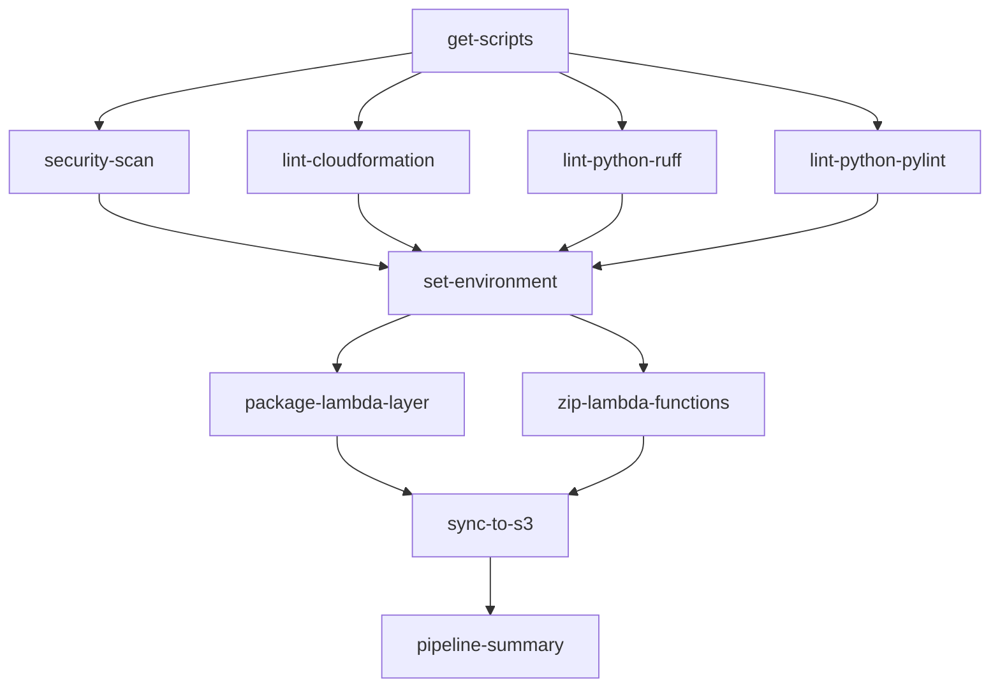

# GitHub Actions DevOps Pipeline Setup

This guide provides instructions for migrating the GitLab CI DevOps CloudFormation pipeline to GitHub Actions with secure AWS OIDC authentication.

## 🔐 AWS OIDC Configuration

### Step 1: Create AWS OIDC Identity Provider

Run this AWS CLI command to create the OIDC identity provider:

```bash
aws iam create-open-id-connect-provider \
  --url https://token.actions.githubusercontent.com \
  --client-id-list sts.amazonaws.com \
  --thumbprint-list 6938fd4d98bab03faadb97b34396831e3780aea1 \
  --thumbprint-list 1c58a3a8518e8759bf075b76b750d4f2df264fcd
```

### Step 2: Create IAM Role for GitHub Actions

Create an IAM role with this trust policy (replace `YOUR_GITHUB_ORG` and `YOUR_REPO_NAME`):

```json
{
  "Version": "2012-10-17",
  "Statement": [
    {
      "Effect": "Allow",
      "Principal": {
        "Federated": "arn:aws:iam::YOUR_AWS_ACCOUNT_ID:oidc-provider/token.actions.githubusercontent.com"
      },
      "Action": "sts:AssumeRoleWithWebIdentity",
      "Condition": {
        "StringEquals": {
          "token.actions.githubusercontent.com:aud": "sts.amazonaws.com"
        },
        "StringLike": {
          "token.actions.githubusercontent.com:sub": "repo:YOUR_GITHUB_ORG/YOUR_REPO_NAME:*"
        }
      }
    }
  ]
}
```

### Step 3: Attach Required Policies to the Role

The role needs these AWS permissions based on the pipeline operations:

```bash
# S3 permissions for syncing files
aws iam attach-role-policy \
  --role-name GitHubActionsDevOpsRole \
  --policy-arn arn:aws:iam::aws:policy/AmazonS3FullAccess

# Lambda permissions for layer management
aws iam attach-role-policy \
  --role-name GitHubActionsDevOpsRole \
  --policy-arn arn:aws:iam::aws:policy/AWSLambda_FullAccess

# CloudFormation permissions
aws iam attach-role-policy \
  --role-name GitHubActionsDevOpsRole \
  --policy-arn arn:aws:iam::aws:policy/AWSCloudFormationReadOnlyAccess
```

Or create a custom policy with minimal required permissions:

```json
{
  "Version": "2012-10-17",
  "Statement": [
    {
      "Effect": "Allow",
      "Action": [
        "s3:GetObject",
        "s3:PutObject",
        "s3:DeleteObject",
        "s3:ListBucket",
        "s3:GetBucketLocation",
        "lambda:CreateFunction",
        "lambda:UpdateFunctionCode",
        "lambda:PublishLayerVersion",
        "lambda:GetLayerVersion",
        "cloudformation:ValidateTemplate",
        "sts:AssumeRole"
      ],
      "Resource": "*"
    }
  ]
}
```

## 🔑 GitHub Repository Secrets

Configure these secrets in your GitHub repository (`Settings > Secrets and variables > Actions`):

### Required Secrets

| Secret Name | Description | Example Value |
|-------------|-------------|---------------|
| `AWS_DEVOPS_ROLE_ARN` | ARN of the IAM role created above | `arn:aws:iam::123456789012:role/GitHubActionsDevOpsRole` |
| `AWS_DEFAULT_REGION` | AWS region for operations | `us-east-1` |

### Optional Secrets (if needed by scripts)

| Secret Name | Description |
|-------------|-------------|
| `AWS_S3_BUCKET` | Target S3 bucket for syncing |
| `ENVIRONMENT` | Deployment environment (dev/staging/prod) |

## 📁 Pipeline Structure Mapping

The GitHub Actions workflow maps GitLab CI stages as follows:

| GitLab CI Stage | GitHub Actions Job | Description |
|----------------|-------------------|-------------|
| `get_scripts` | `get-scripts` | Downloads and caches scripts |
| `scan_creds` | `security-scan` | Runs credential scanning |
| `lint_cfn` | `lint-cloudformation` | CloudFormation template linting |
| `lint_py` (ruff) | `lint-python-ruff` | Python code quality with ruff |
| `lint_py` (pylint) | `lint-python-pylint` | Python code quality with pylint |
| `set_env` | `set-environment` | Environment variable setup |
| `package_ob_layer` | `package-lambda-layer` | Lambda layer packaging |
| `zip` | `zip-lambda-functions` | Lambda function zipping |
| `sync_s3` | `sync-to-s3` | S3 synchronization with matrix strategy |

## 🔄 Key Differences from GitLab CI

### Advantages
- **Native AWS OIDC**: No need to store AWS credentials as secrets
- **Better artifact handling**: GitHub Actions provides built-in artifact management
- **Matrix builds**: Parallel execution of S3 sync for different lambda directories
- **Improved caching**: Better dependency and script caching capabilities

### Dependencies and Job Flow


## 🛠 Required Scripts

The pipeline depends on these scripts from your repository:

- `Scripts/General/ScanCreds.py` - Credential scanning
- `Scripts/General/SetEnv.sh` - Environment variable setup
- `Scripts/General/ZipDirs.sh` - Lambda function zipping
- `Scripts/DevOps/AWS/PackageLayerAWS.sh` - Lambda layer packaging
- `Scripts/General/GetAuthAWSDevops.sh` - AWS authentication for DevOps
- `Scripts/General/SyncS3.sh` - S3 synchronization

## 🚀 Testing the Pipeline

1. **Push to a protected branch** (`main`, `dev`, `staging`) to trigger the pipeline
2. **Create a pull request** to `main` to run validation jobs
3. **Manual dispatch** via GitHub Actions UI for testing

## 🔍 Monitoring and Debugging

- **Logs**: View detailed logs in the GitHub Actions tab
- **Artifacts**: Download build artifacts from the workflow run
- **Matrix jobs**: Monitor parallel S3 sync jobs independently
- **Continue-on-error**: Some jobs are configured to continue on failure (marked in workflow)

## 📋 Migration Checklist

- [ ] Create AWS OIDC Identity Provider
- [ ] Create IAM Role with proper trust policy
- [ ] Attach required AWS policies to role
- [ ] Configure GitHub repository secrets
- [ ] Test script paths and permissions
- [ ] Validate artifact uploads/downloads
- [ ] Test AWS authentication in pipeline
- [ ] Verify S3 sync functionality
- [ ] Monitor pipeline execution logs

## 🔧 Troubleshooting

### Common Issues

1. **OIDC Authentication Failure**
   - Verify trust policy has correct GitHub repository path
   - Check OIDC provider thumbprints are current
   - Ensure role ARN is correctly set in secrets

2. **Script Execution Errors**
   - Check script file paths match repository structure
   - Verify script permissions (`chmod +x` if needed)
   - Ensure environment variables are properly passed

3. **AWS Permission Errors**
   - Review IAM role policies
   - Check resource-specific permissions
   - Verify AWS region configuration

4. **Artifact Issues**
   - Check artifact upload/download paths
   - Verify artifact retention policies
   - Monitor artifact size limits

This setup provides a secure, scalable migration from GitLab CI to GitHub Actions while maintaining the same functionality and improving upon the original pipeline structure.